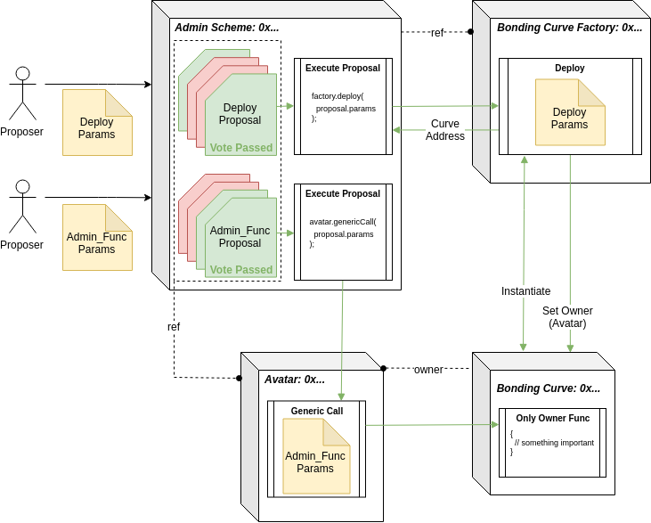
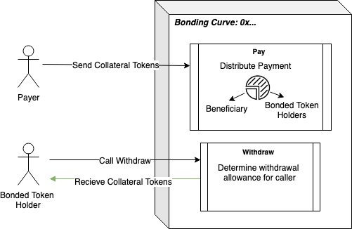

# Bonding Curves For DAOs  
In this document, we'll describe how to configure your DAO to:  
1. deploy and administrate its own Bonding Curve  
2. invest in Bonding Curves  

*Note that the "Admin" & "Invest" schemes described below have been created for a specific bonding curve implementation, and cannot be used for all implementations. See the "Bonding Curve" section below to better understand the initial implementation we're building and supporting. In the future, more schemes will be developed to support different bonding curve implementations.*  

# Admin Scheme: Deploy & Administrate  
**[Feature]**  
The Admin Scheme enables a DAO to deploy new curves, and administrate previously deployed curves than an avatar now owns. Some examples of administrative functions may include:  
- Changing Parameters  
- Transfering Ownership  
- etc  

## Architecture  
  

## Usage  
[**`proposeDeploy`**](../../features/BondingCurveAdminSchemes/contracts/BondingCurveAdminScheme.sol): Create a proposal that, when passed & executed, will deploy the bonding curve with the specified parameters. Before calling this function, the curve's parameters must be set using the [`setCurveParameters`](../../features/BondingCurveAdminSchemes/contracts/BondingCurveAdminScheme.sol) function. This will return the hash of the parameters, wich should be then passed to `proposeDeploy`'s `bytes32 _curveParams` argument.  
```
function proposeDeploy(
  Avatar _avatar,
  string memory _name,
  string memory _symbol,
  address payable _beneficiary,
  bytes32 _curveParams
) public returns(bytes32)
```
```
function setCurveParameters(
  uint256 _buySlope,
  uint256 _sellSlope,
  uint256 _buyIntercept,
  uint256 _sellIntercept,
  ERC20 _reserveToken,
  uint _dividendRatio
) public returns(bytes32)
```

[**`propose{Admin_Func}`**](../../features/BondingCurveAdminSchemes/contracts/BondingCurveAdminScheme.sol): Create a proposal that, when passed & executed, will call the specified "Admin Function" that only the owning avatar can call. It does this through a "Generic Call", which invokes the specified function through the Avatar, making the Avatar == msg.sender. An example of an "Admin Function" Proposal is [`proposeChangeBeneficiary`](../../features/BondingCurveAdminSchemes/contracts/BondingCurveAdminScheme.sol).  
```
function proposeChangeBeneficiary(
  Avatar _avatar,
  BondingCurve _curve,
  address payable _newBeneficiary
) public returns (bytes32)
```

[**`executeProposal`**](../../features/BondingCurveAdminSchemes/contracts/BondingCurveAdminScheme.sol): This will be called by the voting machine when the vote has passed. This will in turn call the proposal type specific execute functions.
```
function executeProposal(bytes32 _proposalId, int256 _param)
external
onlyVotingMachine(_proposalId)
returns(bool)
```

TODO: change hyperlinks to point to auto-gen docs  

## Setup  
**Scheme Deployment**: This is a universal scheme, meaning it is deployed once and used for N number of DAOs. (TODO: tell reader where to find the address)  

**DAO Configuration**: This scheme can be added to a DAO's controller just like any other through the [`SchemeRegistrar`](https://github.com/daostack/arc/blob/master/contracts/universalSchemes/SchemeRegistrar.sol). NOTE: This scheme requires the [`Generic Action` permission](https://github.com/daostack/arc/blob/f5e16c2b78d85e7290b32b145524667e80c405e3/contracts/controller/UController.sol#L19) (5th bit `0x00000010`).  

## Contract Docs  
TODO: link to auto generated contract docs (still WIP, Milestone 2)  

# Invest Scheme: Buy & Sell  
**[Feature]**  
The Invest Scheme enables a DAO to buy and sell from bonding curves. Additionally it provides support for any other token utility functionality, such as claiming dividends.  

## Architecture  
  

## Usage  
[**`proposeBuy`**](../../features/BondingCurveInvestSchemes/contracts/BondingCurveInvestScheme.sol): Create a proposal that, when passed & executed, will call the buy function on the bonding curve on behalf of the Avatar.  
```
function proposeBuy(
  Avatar _avatar,
  BondingCurve _curve,
  uint256 _etherToSpend
) public returns(bytes32)
```

[**`proposeSell`**](../../features/BondingCurveInvestSchemes/contracts/BondingCurveInvestScheme.sol): Create a proposal that, when passed & executed, will call the sell function on the bonding curve on behalf of the Avatar.  
```
function proposeSell(
  Avatar _avatar,
  BondingCurve _curve,
  uint256 _tokensToSell
) public returns(bytes32)
```

[**`executeProposal`**](../../features/BondingCurveInvestSchemes/contracts/BondingCurveInvestScheme.sol): This will be called by the voting machine when the vote has passed. This will in turn call the proposal type specific execute functions.
```
function executeProposal(bytes32 _proposalId, int256 _param)
external
onlyVotingMachine(_proposalId)
returns(bool)
```

## Setup  
**Scheme Deployment**: This is a universal scheme, meaning it is deployed once and used for N number of DAOs. (TODO: tell reader where to find the address)  

**DAO Configuration**: This scheme can be added to a DAO's controller just like any other through the [`SchemeRegistrar`](https://github.com/daostack/arc/blob/master/contracts/universalSchemes/SchemeRegistrar.sol). NOTE: This scheme requires the [`Generic Action` permission](https://github.com/daostack/arc/blob/f5e16c2b78d85e7290b32b145524667e80c405e3/contracts/controller/UController.sol#L19) (5th bit `0x00000010`).  

## Contract Docs  
TODO: link to auto generated contract docs (still WIP, Milestone 2)  

# Bonding Curve  
**[Utility]**  
TODO: short description (high level architecture + diagram)  

Bonding Curves can be deployed in the service of a DAO, or independently. Our initial implementation offers support for various curve implementations and dividends to distribute earnings to token holders.

### Key Terms

* **bondingCurve**: The 'avatar' of the bonding curve. It serves as the external interface to interact with the curve, with automated market maker and dividend tracking functions.
* **bondedToken**: Token native to the curve. The bondingCurve Contract has exclusive rights to mint / burn tokens.
* **collateralToken**: Token accepted as collateral by the curve (e.g. WETH or DAI)
* **reserve**: Balance of collateralTokens that the curve holds to repurchase bondedTokens	
* **beneficiary**: Entity that receives collateralTokens from the curve			
* **splitOnBuy**: % of collateralTokens distributed to beneficiary on buy(). This is implicitly set by the spread between the buy and sell curves. The remaining % is added to the reserve.
* **splitOnPay**: % of collateralTokens distributed to beneficiary on pay(). Explicitly defined, with the remainding % being distributed among current bondedToken holders.

| Function | Actor | Analogy | Actor sends.. | bondedToken are.. | collateralTokens are.. | bondedToken price.. |
| --- | --- | --- | --- | --- | --- | --- |
| Buy() | Not beneficiary | "Investment" | collateral token | minted to sender | split between reserve and beneficiary based on splitOnBuy % | increases |
| Buy() | beneficiary | "Buy-back" | collateral token | burned | deposited in reserve | increases |
| Sell() | Anyone | "Divestment" | bonded token | burned | transferred to sender | decreases |
| Pay() | Anyone | "Dividend" | collateral token | not changed | split between bondedToken holders and beneficiary based on splitOnPay % | remains the same |

#### Buy Flow


#### Payment Flow


## Setup  
**Deployment** Bonding Curves can be deployed via a BondingCurveFactory. We will provide factories as part of the universal scheme, though users can also choose to deploy how they see fit.

This will include a Bonding Curve, Bonded Token, and buy / sell Curve Logic.


## Usage  
[**`buy`**](../../utilities/BondingCurves/contracts/bonding-curve/BondingCurve.sol): Buy bondedTokens in exchange for collateralTokens
```
function buy(
  uint256 numTokens
) public
```

[**`sell`**](../../utilities/BondingCurves/contracts/bonding-curve/BondingCurve.sol): Create a proposal that, when passed & executed, will call the sell function on the bonding curve on behalf of the Avatar.  
```
function sell(
  uint256 numTokens
) public
```

[**`pay`**](../../utilities/BondingCurves/contracts/bonding-curve/BondingCurve.sol): Pay the DAO in collateralTokens. Revenue send in this method is distributed between the beneficiary and the bonded token holders according to the paySplit;
```
function pay(
  uint256 amount
) public
```

[**`priceToBuy`**](../../utilities/BondingCurves/contracts/bonding-curve/BondingCurve.sol): Determine the current price to buy a given number of bondedTokens. 
```
function priceToBuy(
  uint256 numTokens
) public
```

[**`rewardForSell`**](../../utilities/BondingCurves/contracts/bonding-curve/BondingCurve.sol): Determine the current payout in collateralTokens to sell a given number of bondedTokens. 
```
function rewardForSell(
  uint256 numTokenss
) public
```

[**`withdraw`**](../../utilities/BondingCurves/contracts/bonding-curve/BondingCurve.sol): Withdraw collateralToken dividends sender is entitled to for a given period, in blocks. 
```
function withdraw(
  uint start,
  uint end
) public
```

## Current Limitations


## Contract Docs  
TODO: link to auto generated contract docs (still WIP, Milestone 2)  
