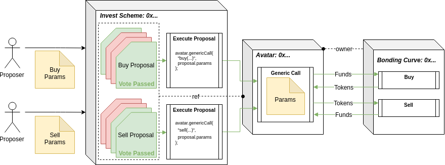

`NOTE: Do not use these contracts in production! All contracts in this repository are currently in alpha stage unless stated otherwise.`

# Bonding Curves For DAOs  
In this document, we'll describe how to configure your DAO to:  
1. Deploy and administrate its own Bonding Curve  
2. Invest in Bonding Curves  

*Note that the "Admin" & "Invest" schemes described below have been created for a specific bonding curve implementation, and cannot be used for all implementations. See the "Bonding Curve" section below to better understand the initial implementation we're building and supporting. In the future, more schemes will be developed to support different bonding curve implementations.*  

# Admin Scheme: Deploy & Administrate  
**[Feature]**  
The Admin Scheme enables a DAO to deploy new curves and administer existing curves owned by the DAO Avatar. Some examples of administrative functions may include:  
- Changing Parameters
- Transfering Ownership

## Architecture  
  

## Usage  
[**`proposeDeploy`**](./contracts/Schemes/BondingCurveAdminScheme.sol): Create a proposal that, when passed & executed, will deploy the bonding curve with the specified parameters. Before calling this function, the curve's parameters must be set using the [`setCurveParameters`](./contracts/Schemes/BondingCurveAdminScheme.sol) function. This will return the hash of the parameters, wich should be then passed to `proposeDeploy`'s `bytes32 _curveParams` argument.  
```
function proposeDeploy(
  Avatar _avatar,
  string memory _name,
  string memory _symbol,
  address payable _beneficiary,
  bytes32 _curveParams
) public returns(bytes32)
```
```
function setCurveParameters(
  uint256 _buySlope,
  uint256 _sellSlope,
  uint256 _buyIntercept,
  uint256 _sellIntercept,
  ERC20 _reserveToken,
  uint _dividendRatio
) public returns(bytes32)
```

[**`propose{Admin_Func}`**](./contracts/Schemes/BondingCurveAdminScheme.sol): Create a proposal that, when passed & executed, will call the specified "Admin Function" that only the owning avatar can call. It does this through a "Generic Call", which invokes the specified function through the Avatar, making the Avatar == msg.sender. An example of an "Admin Function" Proposal is [`proposeChangeBeneficiary`](./contracts/Schemes/BondingCurveAdminScheme.sol).  
```
function proposeChangeBeneficiary(
  Avatar _avatar,
  BondingCurve _curve,
  address payable _newBeneficiary
) public returns (bytes32)
```

[**`executeProposal`**](./contracts/Schemes/BondingCurveAdminScheme.sol): This will be called by the voting machine when the vote has passed. This will in turn call the proposal type specific execute functions.
```
function executeProposal(bytes32 _proposalId, int256 _param)
external
onlyVotingMachine(_proposalId)
returns(bool)
```

TODO: link to auto generated contract docs (still WIP, Milestone 2)  

## Setup  
**Scheme Deployment**: This is a universal scheme, meaning it is deployed once and used for N number of DAOs. (TODO: tell reader where to find the address)  

**DAO Configuration**: This scheme can be added to a DAO's controller just like any other through the [`SchemeRegistrar`](https://github.com/daostack/arc/blob/master/contracts/universalSchemes/SchemeRegistrar.sol). NOTE: This scheme requires the [`Generic Action` permission](https://github.com/daostack/arc/blob/f5e16c2b78d85e7290b32b145524667e80c405e3/contracts/controller/UController.sol#L19) (5th bit `0x00000010`).  

## Contract Docs  
TODO: link to auto generated contract docs (still WIP, Milestone 2)  

# Invest Scheme: Buy & Sell  
**[Feature]**  
The Invest Scheme enables a DAO to buy and sell from bonding curves. Additionally it provides support for any other token utility functionality, such as claiming dividends.  

## Architecture  
  

## Usage  
[**`proposeBuy`**](./contracts/Schemes/BondingCurveInvestScheme.sol): Create a proposal that, when passed & executed, will call the buy function on the bonding curve on behalf of the Avatar.  
```
function proposeBuy(
  Avatar _avatar,
  BondingCurve _curve,
  uint256 _etherToSpend
) public returns(bytes32)
```

[**`proposeSell`**](./contracts/Schemes/BondingCurveInvestScheme.sol): Create a proposal that, when passed & executed, will call the sell function on the bonding curve on behalf of the Avatar.  
```
function proposeSell(
  Avatar _avatar,
  BondingCurve _curve,
  uint256 _tokensToSell
) public returns(bytes32)
```

[**`executeProposal`**](./contracts/Schemes/BondingCurveInvestScheme.sol): This will be called by the voting machine when the vote has passed. This will in turn call the proposal type specific execute functions.
```
function executeProposal(bytes32 _proposalId, int256 _param)
external
onlyVotingMachine(_proposalId)
returns(bool)
```

## Setup  
**Scheme Deployment**: This is a universal scheme, meaning it is deployed once and used for N number of DAOs. (TODO: tell reader where to find the address)  

**DAO Configuration**: This scheme can be added to a DAO's controller just like any other through the [`SchemeRegistrar`](https://github.com/daostack/arc/blob/master/contracts/universalSchemes/SchemeRegistrar.sol). NOTE: This scheme requires the [`Generic Action` permission](https://github.com/daostack/arc/blob/f5e16c2b78d85e7290b32b145524667e80c405e3/contracts/controller/UController.sol#L19) (5th bit `0x00000010`).  

## Contract Docs  
TODO: link to auto generated contract docs (still WIP, Milestone 2)  

# Bonding Curve  
**[Utility]**  
  Bonding Curves can be used to enable continuous funding for a DAO. Our implementation is heavily inspired by the Continous Organization model described in the [cOrg whitepaper](https://github.com/C-ORG/whitepaper). 

The current iteration supports modular curve implementations and gives token holders rights to dividend distribtions as the DAO gains revenue.

### Key Terms

* **bondingCurve**: The 'avatar' of the bonding curve. It serves as the external interface to interact with the curve, with automated market maker and dividend right tracking functions.
* **bondedToken**: Token native to the curve. The bondingCurve Contract has exclusive rights to mint / burn tokens.
* **collateralToken**: Token accepted as collateral by the curve (e.g. WETH or DAI)
* **reserve**: Balance of collateralTokens that the curve holds to repurchase bondedTokens	
* **beneficiary**: Entity that receives funding from the purchase of bondedTokens. This would typically be the DAO Avatar.
* **splitOnBuy**: Percentage of incoming collateralTokens distributed to beneficiary on buy(). This is implicitly set by the spread between the buy and sell curves at the given point. The remaining portion is added to the reserve.
* **splitOnPay**: Percentage of incoming collateralTokens distributed to beneficiary on pay(). This is an explicit parameter, with the remainder being distributed among current bondedToken holders.

### Key Actions
The following chart describes the actions users can take to interact with the Bonding Curve:

| Action | Actor | Analogy | Actor sends.. | bondedToken are.. | collateralTokens are.. | bondedToken price.. |
| --- | --- | --- | --- | --- | --- | --- |
| Buy() | Anyone, _except beneficiary_ | "Investment" | collateral token | minted to sender | split between reserve and beneficiary based on splitOnBuy % | increases |
| Buy() | _beneficiary_ | "Buy-back" | collateral token | burned | deposited in reserve | increases |
| Sell() | Anyone | "Divestment" | bonded token | burned | transferred to sender | decreases |
| Pay() | Anyone | "Dividend" | collateral token | not changed | split between bondedToken holders and beneficiary based on splitOnPay % | remains the same |

#### Buy Flow


#### Payment Flow


## Setup  
**Deployment** Bonding Curves can be deployed via a BondingCurveFactory. We will provide factories as part of the universal scheme, though users can also choose to deploy how they see fit.

This will include deploying a Bonding Curve, Bonded Token, and buy / sell Curve Logic contracts.


## Usage  
[**`priceToBuy`**](./contracts/BondingCurve/BondingCurve.sol): Determine the current price in collateralTokens to buy a given number of bondedTokens. 
```
function priceToBuy(
  uint256 numTokens
) public
```

[**`rewardForSell`**](./contracts/BondingCurve/BondingCurve.sol): Determine the current payout in collateralTokens to sell a given number of bondedTokens. 
```
function rewardForSell(
  uint256 numTokens,
) public
```

[**`buy`**](./contracts/BondingCurve/BondingCurve.sol): Buy a given number of bondedTokens with an amount of collateralTokens determined by the current rate from the buy curve. The caller can specify the maximum total price in collateralTokens they're willing to pay, and a recipient address to transfer the new bondedTokens to. 

The appropriate amount of collateralTokens must have previously been approved for the bonding curve contract by the caller.
```
function buy(
  uint256 numTokens,
  uint256 maxPrice,
  address recipient
) public
```

[**`sell`**](./contracts/BondingCurve/BondingCurve.sol): Sell a given number of bondedTokens for an amount of collateralTokens determined by the current rate from the sell curve. The caller can set a minimum total value of collateralTokens they're willing to sell for, and a recipient to transfer the proceeds of the sale to.
```
function sell(
  uint256 numTokens,
  uint256 minPrice,
  address recipient
) public
```

[**`pay`**](./contracts/BondingCurve/BondingCurve.sol): Pay the DAO in collateralTokens. Revenue send in this method is distributed between the beneficiary and the bondedToken holders according to the splitOnPay parameter;
```
function pay(
  uint256 amount
) public
```

[**`withdraw`**](./contracts/BondingCurve/BondingCurve.sol): Withdraw collateralToken dividends sender is entitled to for a given period, in blocks. 
```
function withdraw(
  uint start,
  uint end
) public
```

## Current Limitations
- **Dividends are only distributed on pay()** - Without hooks on ERC20 transfers, we can't execute distribution logic when ERC20 tokens are transferred to the BondingCurve via the standard transfer() method. Ideally, we could allow 'native' ERC20 payments to function just as pay() does.

  * We'll be incorporating ERC777 hooks, which will alleiviate this issue for tokens that adopt that standard.

- **Dividend tracking has signicant gas costs** - With bondedTokens represented as ERC20s, we need additional data to track who is entitled to what dividend payemnts. This is currently implemented in a manner similar to [MiniMe Token](https://github.com/Giveth/minime/blob/master/contracts/MiniMeToken.sol), but this approach has significant gas costs.

  * We have an open discussion on this issue, and alternative implementations, [here](https://github.com/dOrgTech/BC-DAO/issues/5).

- **Payments directly to DAO Avatar can circumvent dividends** - It's not possible to stop people from sending ERC20 tokens to the DAO Avatar directly. This would give the DAO voters access to funds without the dividend holders getting their share first.

    * We have an open discussion on this issue [here](https://github.com/dOrgTech/BC-DAO/issues/4).

## Future Plans
We envision the following features may be useful to DAOs implementing bonding curves.

### Financial Features
- **Hatching** - An initial buying phase where selling is disabled up until a certain amount of tokens are bought. This helps ensure a certain amount of return for early investors.
- **Vesting** - Vesting periods can be added to minted tokens, which helps fight against pumping and dumping.
- **Taxes** - A % fee for selling back to the market can be added to encourage secondary market trading.
- **Governance via BondedTokens** - Voting power can be given to token holders somehow, which can help further insulate their potentially risky investment.
- **Multicurrency Reserve** - Allow multiple tokens to be added to reserve as collateralTokens.

### Regulatory Features
- **KYC / Whitelisting** We can use the X list to and accreditation status for US-based investors

### Security Features

- **Additional Front-running Guards** Several variants of order batching have been outlined in the community. In addition, maximum gas prices for transactions may offer a simple mechanic to discourage front-running.

### Technical Features
- **Modularity** We envision an "OpenZeppelin for bonding curves" - a standardized open source repo build your own bonding curve with the functionality for a given use case from well-established components.


## Contract Docs  
TODO: link to auto generated contract docs (still WIP, Milestone 2)  
